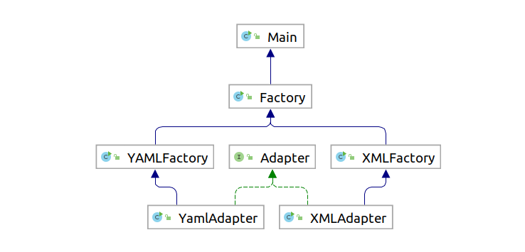
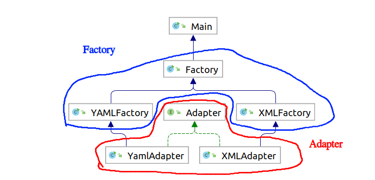

# Questions lab 1, task B

---
by:
Simon Jakobsson (simja649) and
Axel Gard (axega544)

## Q.1
**What specific functionality is offered by the Factory Method and adapter design patterns when enabling
access to these two different implementations? Why do we need to include both as part of our solution?**

Answer:
By using the factory method we ensure that we have the ability to produce the different builds
that are representable (YAML and or XML) with their own class implementation but still have the same
interface. With the factory design pattern it is easy to expand or retract the different builds we can
choose from. This adds a level of abstraction from the implementation and the interface that the client interacts with.

Using the adapter design we create a kind of hub to the client (or main in this case) so it is easy to adapt to
what kind of build you are creating. By using the adapter pattern we are also able to separate the
implementation from the interaction meaning that we could change the adapter's implementation without
affecting the higher level functions.

We use both design patterns because we need to be able to create the builds which the factory design does
and we need adapter design to separate the method of building the different builds of YAML and XML.
Thus we can keep the same interface in the YAML or XML factory class but have very different implementations
in the adapter. We could put the different  implementation in the factory class, but this way we are able to separate
the creation of an object from its implementation.

## Q.2
**How can your solution benefit the users of this application? Justify your design by explaining how it is intended to
be used, and what information is required by the client(an application that uses your Adapter/Factory implementation,
or extends it)**

Answer:
The client does not need to understand how it processes xml or yaml, they simply need to enter the correct filetype and
the program will take care of the rest.

The way the design is intended to be used is that we create a factory that can create either a new XMLFactory or YAMLFactory
(see UML diagram). When creating either of these we create a method that receives a Adapter of designated build,
which inherits from an Interface adapter (see uml) with the method buildTarget. These adapters have all the configuration readers
from the configuration classes of each build, creating the build there. We accept the filename from the XML or YAMLfactory so
we don't need to pass it twice.  This also means that if changes are made to one of the implementations there is no effect on
the other, making it easier to maintain and expand upon.

---

# Reflection rapport seminar 2 

We learnt that there is mostly a streamlined process to apply the different design patterns. Or at least for task B we noticed that
many of us did solve the question in mostly the same way. We got confirmation that we were on the right track by the assistant and
thus we feel that we do not have to change our code after the seminar.

Our weakness is how the design patterns should be implemented. We started with an intuition that we had done the right factory
design but found ourselves in a strategy design pattern by accident, both working as intended. So we need to have a better
understanding of how the implementation differential is between all the design patterns.

Our strength is that we clearly have a better understanding since last week what design patterns are, why they are used and how
you should implement them (nearly correct).

We feel that it would be appreciated if more exact implementation details were given about what separates the different patterns
from each other when they are in the same category such as creational patterns.
