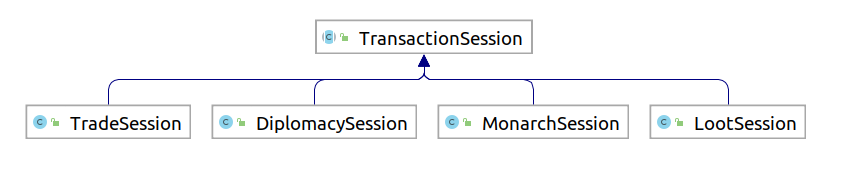
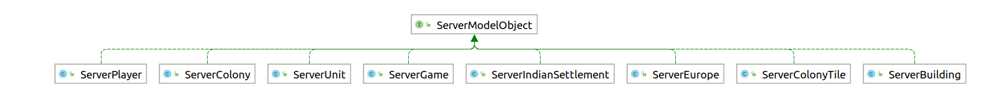

# Report lab 2, model 

by: Simon Jakobsson (simja649) and Axel Gard (axega544)

### Flyweight:

 ```
  src/net/sf/freecol/server/model/ServerRegion.java
  src/net/sf/freecol/common/model/Region.java
  src/net/sf/freecol/server/generator/TerrainGenerator.java
  private List<ServerRegion> createRivers(Map map, LogBuilder lb)  
  ```

  Design pattern Flyweight is used to create regions as rivers and to save memory the Flyweight pattern is used.
  A list of river regions keeps track of all the objects, but because a new instance of the class is initialized the pattern 
  is Flyweight and not prototype. The River regions are not initialized with clones like they would have been if the 
  prototype was used, instead the constructor is called with a new key word.

### Mediator :

```
src/net/sf/freecol/server/model/TransactionSession.java
src/net/sf/freecol/server/model/TradeSession.java
src/net/sf/freecol/server/model/MonarchSession.java
```

Design pattern mediator is used here. We have a transaction sessions of different types that creates transactions between objects.
We define it abstract because we share commonalities from TransactionSession to other session types. In order to 
complete a session of some kind (trade, loot etc.) we have an interaction requiring a mediator.




### Observer:

```
src/net/sf/freecol/server/model/ServerModelObject.java
src/net/sf/freecol/server/model/ServerGame.java
public List<ServerPlayer> getConnectedPlayers(ServerPlayer... serverPlayers)
```

Design pattern observer is used here. Servergame has a list of subscribers, Player. Get connectedPlayers, 
map with filter. Also, **sendToAll** that sends to a list of server players. Thus, we have an SUB and PUB behaviour, 
which is the defining characteristics of observer pattern.  



## Violations:

### Single responsibility:

```
src/net/sf/freecol/server/model/ServerColony.java
public void csNewTurn(Random random, LogBuilder lb, ChangeSet cs)
```

It violates single responsibility in SOLID.
It handles experience gain, deletes game objects, invalidate caches etc. Which should be in different methods, and thus it violates SOLID

### Interface segregation principle:

```
src/net/sf/freecol/server/model/ServerGame.java
public boolean equals(Object o)
```

ServerGame breaks interface segregation principle. Implements unnecessary methods they do not use.

---- 
# Reflection report seminar 3

We learnt that depending on what design pattern has been implemented, it may be harder to identify what they are and how 
they are structured in code, compared to just looking at a UML on wikipedia how it is done.

We decided to define our findings in the lab by adding UML to prove the different design patterns that are used. 
This makes it more clear what we have found and how it was implemented.

We are confident where to find violations in the SOLID principle. We are pretty confident where to identify where 
design patterns are used but some implementation details are still lacking in our knowledge.

Under the seminar we were able to identify the other groups' design patterns and violations, but there were one or 
two we misunderstood the pattern and got it wrong. One of our own patterns we understood under the seminar by 
the other group was wrong, and we had to correct it after the seminar. So we changed Template method to Mediator. 

The other groups were able to identify all but one of our pattern and violations, that being the design pattern flyweight.

