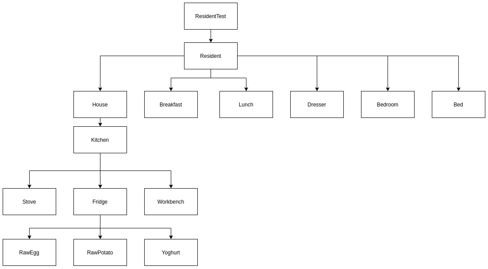
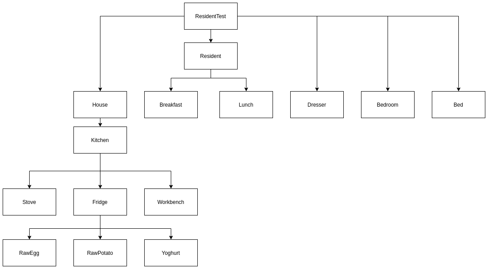
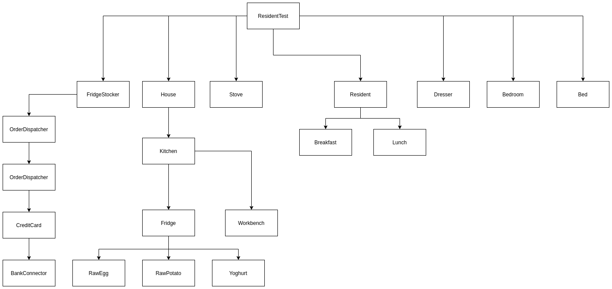
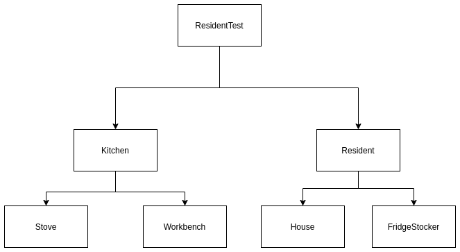

# Testability

Simon Jakobsson (simja649) and
Axel Gard (axega544)

## 2.1
### How do we get a hold of the fridge to stock?

Answer: add a isStocked public function to the class fridge.
This makes it easy to check the state of the fridge.

### Is there anything else that can be done to improve the testability?
Answer: add overloading constructors for a house, kitchen and fridge. This makes
it easier to test different states of each class. But keep a default constructor
still for normal usage.

```java
public Fridge(bool isStocked){
  this.stocked = isStocked;
}

```

plz add to docs https://maven.apache.org/guides/introduction/introduction-to-the-lifecycle.html#setting-up-your-project-to-use-the-build-lifecycle

```
mvn compile
mvn test
```


## 2.2

### Creation


### Collaboration


## 2.3

### were any hidden dependencies to Fridge, much less FridgeStocker

Answer:  Fridge and FridgeStocker has a hidden dependence, as well as all singeltons are require initalization.

### did anything about Fridge tell you that it not only needs a FridgeStocker, but an initialized one?

Answer: Due to FridgeStocker needing to be initalized we end up with a dependencies to all singeltons.

## 2.8

### Let us repeat the exercise from Section 2.2. Which differences do you spot? Which conclusions can you draw from this?


Answer:
By refactor we can see that the structure have changed quite a bit.
The creation implementation has increased significantly, by being moved closer
to test. This will help with the testability because we can set state of a test
in the ResidentTest class. Thus collaboration implementation has been reduced.


### Creation


### Collaboration



### How might this be expressed in terms of overlap versus separation of construction and collaboration graphs?

Answer:
The change that we have made means that the construction graph will go down in
cohesion between different objects. But the collaboration graph will end
up being higher in cohesion. But having higher cohesion in the collaboration graph
will not be as bad due to that the objects can handle different states of the collaboration
objects if needed can create them. So the object is not as dependent on the state.  


# Reflection rapport seminar 7

During this seminar we in the group discussed how we solved the different tasks in the lab. Most of us had done pretty much the same solutions and such, we didn't really have an argument about which way was better than another.  We discussed the video and particularly the weakest link and tried to understand how to interpret it to software. The best way we could describe it was compared to a webserver with frontend and backend. Where the frontend would crash as the weakest link to understand that the server was overloaded. Something we understood under the seminar was that we missed task 2.8 and did not complete another graph to compare. So to the handin we corrected that issue.

Showing that you understood the contents. What are your weaknesses and strengths of the different topics?

Testing is something that we have touched on, in some other courses. This meant that we had some familiarity with the subject and thus made it easier to get started with the labs.
The weakness in this case was probably that we ended up trying to interpret the lab in different ways, making it take longer to complete.

It would be good to add to docs for [maven build lifecycle](https://maven.apache.org/guides/introduction/introduction-to-the-lifecycle.html#setting-up-your-project-to-use-the-build-lifecycle)
